# Modul 5 - Event dan State React/Next.js

Pada Modul 5 saya mempelajari penggunaan event handler dan state pada React/Next.js. Praktikum meliputi penggunaan event `onClick`, props, event propagation, `useState`, pengelolaan form, serta cara menghindari state yang redundan.

---

## Praktikum 1 - Event Handler

Pada praktikum pertama dibuat sebuah tombol yang merespons interaksi pengguna.

Event handler yang digunakan antara lain:

```tsx
onClick={handleClick}
onMouseOver={handleMouseOver}
```

Fungsi event handler dioper ke JSX tanpa tanda kurung agar fungsi hanya dijalankan ketika event terjadi.

Contoh:

```tsx
onClick={handleClick}
```

bukan:

```tsx
onClick={handleClick()}
```

Ketika tombol diklik akan muncul alert, dan ketika mouse diarahkan ke tombol juga muncul pesan.

### Hasil Praktikum 1

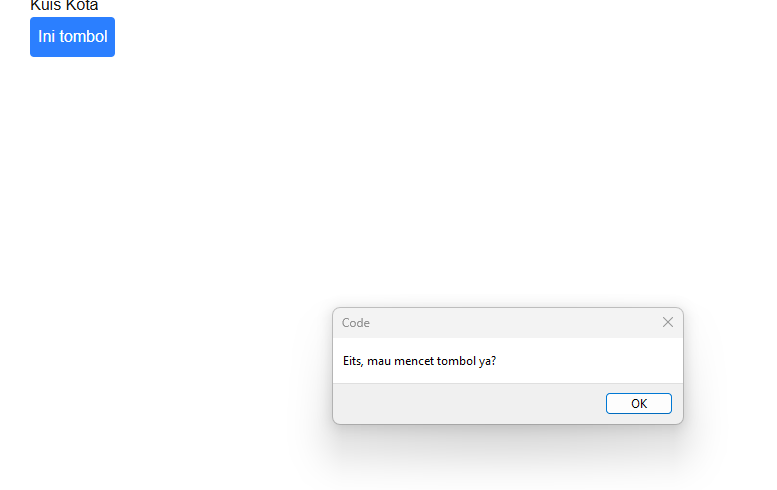

---

## Praktikum 2 - Props pada Event Handler

Pada praktikum ini dibuat komponen tombol yang dapat menerima data melalui props.

Props yang digunakan adalah:

```tsx
isiPesan
namaTombol
```

Contoh penggunaan:

```tsx
<Tombol_2
  isiPesan="Ini Pesanku"
  namaTombol="Pesan"
/>
```

Dengan props, satu komponen tombol dapat digunakan kembali dengan isi pesan dan nama tombol yang berbeda.

Ketika tombol `Pesan` diklik, akan muncul alert:

```text
Ini Pesanku
```

### Hasil Praktikum 2

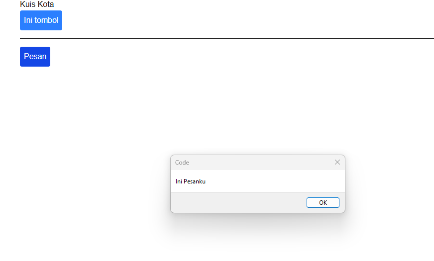

---

## Praktikum 3 - Event Propagation

Pada praktikum ini terdapat event `onClick` pada elemen child berupa button dan pada parent berupa `div`.

Ketika tombol child diklik, event pada child dijalankan terlebih dahulu kemudian event diteruskan ke parent.

Urutan alert yang muncul adalah:

```text
Child Element : Tombol-1
Parent Element : Div
```

Peristiwa tersebut disebut event propagation atau bubbling.

### Hasil Event Propagation

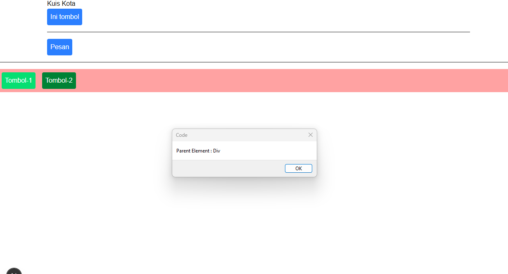

### Stop Propagation

Propagation dapat dihentikan menggunakan:

```tsx
e.stopPropagation();
```

Contoh:

```tsx
onClick={(e) => {
  e.stopPropagation();
  alert(isiPesan);
}}
```

Setelah `stopPropagation()` digunakan, event hanya dijalankan pada tombol child dan tidak diteruskan ke parent.

### Hasil Stop Propagation

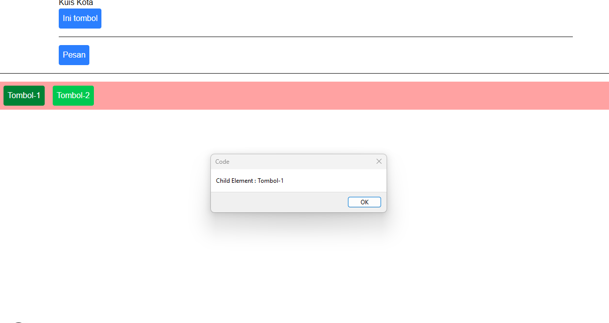

---

## Praktikum 4 - State dengan useState

Pada awal praktikum, nilai artikel disimpan menggunakan variabel lokal:

```tsx
let index = 0;
```

Perubahan pada variabel lokal tidak membuat React melakukan render ulang sehingga perubahan artikel tidak tampil di halaman.

Kemudian variabel tersebut diganti menggunakan state:

```tsx
const [index, setIndex] = useState(0);
```

Untuk berpindah ke artikel berikutnya digunakan:

```tsx
setIndex(index + 1);
```

Dengan `useState`, nilai `index` dapat dipertahankan antar-render dan perubahan state membuat React melakukan render ulang.

### Soal Praktikum 4

Jika tombol `Artikel Selanjutnya` terus ditekan sampai melewati jumlah artikel, aplikasi mengalami Runtime TypeError.

Hal tersebut terjadi karena nilai `index` melewati indeks terakhir array sehingga:

```tsx
sculptureList[index]
```

menghasilkan data `undefined`.

Untuk mengatasinya, nilai index dibatasi agar tidak melewati panjang array:

```tsx
function handleNext() {
  if (index < sculptureList.length - 1) {
    setIndex(index + 1);
  }
}
```

Tombol `Artikel Sebelumnya` juga ditambahkan menggunakan:

```tsx
function handlePrevious() {
  if (index > 0) {
    setIndex(index - 1);
  }
}
```

Tombol akan dinonaktifkan apabila sudah berada pada artikel pertama atau artikel terakhir.

### Hasil Praktikum 4

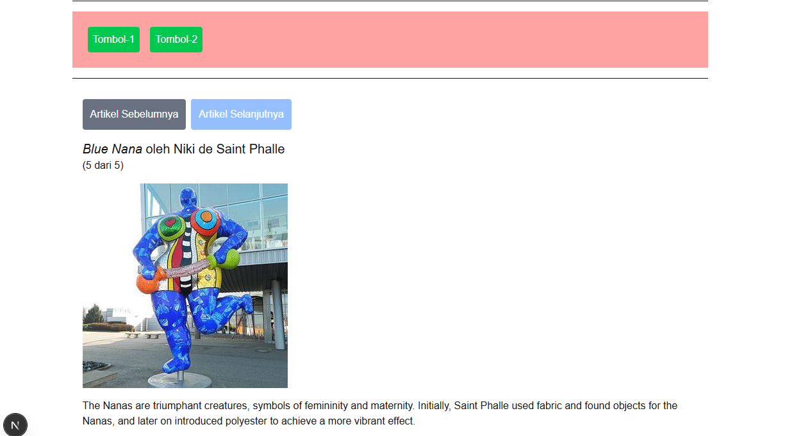

---

## Praktikum 5 - Mengelola State pada Form

Pada praktikum ini dibuat form kuis menggunakan beberapa state:

```tsx
answer
error
status
```

State digunakan untuk menyimpan jawaban pengguna, menampilkan pesan error, dan menentukan kondisi form.

Jika jawaban salah, aplikasi menampilkan:

```text
Jawaban masih salah. Silakan coba lagi.
```

### Hasil Jawaban Salah

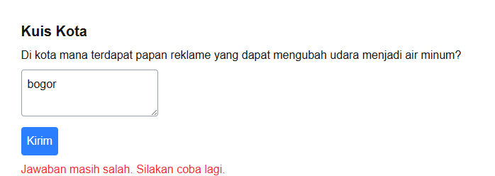

Jika jawaban benar yaitu:

```text
lima
```

maka aplikasi menampilkan:

```text
Jawaban benar!
```

### Hasil Jawaban Benar

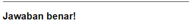

---

## Praktikum 5 - Form_2 dan Struktur State

### Form_2 Versi Pertama

Pada versi pertama terdapat tiga state:

```tsx
const [firstName, setFirstName] = useState("");
const [lastName, setLastName] = useState("");
const [fullName, setFullName] = useState("");
```

State `fullName` harus diperbarui setiap kali `firstName` atau `lastName` berubah.

### Hasil Form_2 Versi Pertama

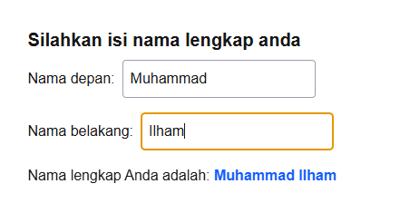

### Form_2 Versi Kedua

Pada versi kedua state `fullName` dihapus.

State yang digunakan hanya:

```tsx
const [firstName, setFirstName] = useState("");
const [lastName, setLastName] = useState("");
```

Nilai nama lengkap dihitung langsung menggunakan:

```tsx
const fullName = firstName + " " + lastName;
```

### Perbedaan Form_2 pertama dan kedua

Pada `Form_2` pertama, `fullName` disimpan sebagai state tersendiri sehingga harus selalu diperbarui ketika `firstName` atau `lastName` berubah.

Pada `Form_2` kedua, `fullName` tidak disimpan sebagai state karena nilainya dapat langsung diperoleh dari `firstName` dan `lastName`.

Versi kedua lebih sederhana dan menghindari penyimpanan data yang redundan.

### Mengapa state fullName perlu dihapus?

State `fullName` perlu dihapus karena nilainya hanya merupakan hasil gabungan dari state `firstName` dan `lastName`.

Jika `fullName` tetap disimpan sebagai state tersendiri, nilainya berisiko tidak sinkron dengan `firstName` dan `lastName`.

Menghitung `fullName` secara langsung membuat kode lebih sederhana dan mengurangi kemungkinan terjadinya bug.

### Hasil Form_2 Versi Kedua

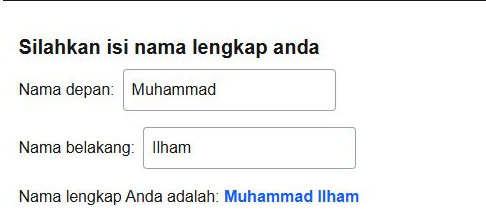

---

## Kesimpulan

Dari Modul 5 saya memahami bahwa event handler digunakan untuk merespons interaksi pengguna, sedangkan state digunakan untuk menyimpan data yang dapat berubah selama aplikasi berjalan.

Saya juga memahami penggunaan props untuk membuat komponen dinamis, event propagation dan `stopPropagation()`, penggunaan `useState`, serta pentingnya menghindari state yang redundan.


---

## Praktikum 6 - Berbagi dan Mengatur Ulang State

### Lifting State Up dengan Accordion

Pada praktikum ini state `activeIndex` disimpan pada komponen parent `Accordion`.

State tersebut menentukan panel mana yang sedang aktif, kemudian informasi tersebut diteruskan ke komponen `Panel` melalui props.

Dengan cara ini, hanya satu panel yang dapat terbuka dalam satu waktu.

Konsep memindahkan state ke parent terdekat agar dapat digunakan oleh beberapa child disebut **lifting state up**.

### Hasil Accordion

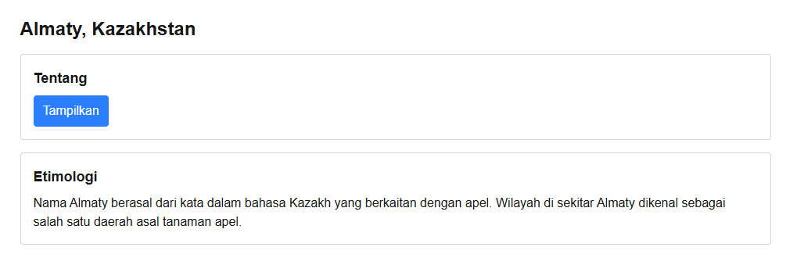

### Mempertahankan State pada Chat

Pada implementasi awal digunakan:

```tsx
<Chat contact={to} />
```

Ketika pesan diketik untuk satu kontak kemudian pengguna berpindah ke kontak lain, isi textarea tetap tersimpan.

Hal ini terjadi karena React masih menganggap komponen `Chat` sebagai komponen yang sama sehingga state `text` dipertahankan.

### Sebelum Menggunakan Key

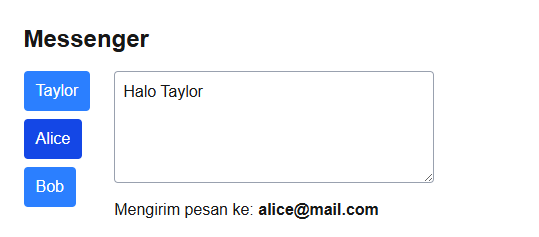

### Mengatur Ulang State dengan Key

Untuk membuat state input di-reset ketika penerima berubah, komponen diubah menjadi:

```tsx
<Chat key={to.email} contact={to} />
```

Dengan `key` yang berbeda, React menganggap setiap chat sebagai komponen yang berbeda. Ketika kontak berubah, komponen `Chat` dibuat ulang sehingga state input kembali ke kondisi awal.

### Setelah Menggunakan Key

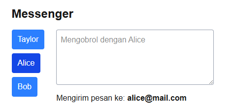

### Kesimpulan Praktikum 6

Dari praktikum ini saya memahami konsep lifting state up untuk berbagi state antar komponen serta penggunaan `key` untuk mengatur ulang state ketika identitas suatu komponen berubah.